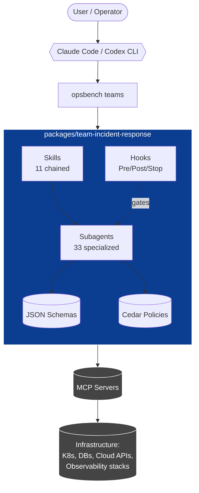

<!--
  opsbench — multi-team agent toolkit for DevOps / SRE / Platform / Infra / IT / Security / Network teams.
  Repository: https://github.com/shaiknoorullah/opsbench
-->

<p align="center">
  <!-- Replace with a real banner once design is ready -->
  <a href="https://github.com/shaiknoorullah/opsbench">
    
  </a>
</p>

<h1 align="center">opsbench</h1>

<p align="center">
  <strong>A multi-team agent toolkit for DevOps, SRE, Platform, Infra, IT, Security, and Network teams using Claude Code and Codex CLI.</strong>
</p>

<p align="center">
  <a href="LICENSE"></a>
  <a href="https://github.com/shaiknoorullah/opsbench/releases"></a>
  <a href="https://github.com/shaiknoorullah/opsbench/actions/workflows/ci.yml"></a>
  <a href="https://github.com/shaiknoorullah/opsbench/stargazers"></a>
  <br>
  <a href="https://www.conventionalcommits.org/"></a>
  <a href="https://docs.claude.com/en/docs/claude-code"></a>
  <a href="https://github.com/openai/codex"></a>
  <a href="GOVERNANCE.md"></a>
</p>

---

## Table of contents

- [What is opsbench?](#what-is-opsbench)
- [Quick install](#quick-install)
- [What's in the box](#whats-in-the-box)
- [Architecture](#architecture)
- [Teams](#teams)
- [Quickstart](#quickstart)
- [Documentation](#documentation)
- [Contributing](#contributing)
- [Roadmap](#roadmap)
- [Standards & inspirations](#standards--inspirations)
- [License](#license)

---

## What is opsbench?

`opsbench` is an **agent toolkit** — a curated set of skills, subagents, JSON schemas, Cedar policies, hooks, and MCP recipes — for operations teams who use AI coding agents (Claude Code, Codex CLI) on production infrastructure.

It is organized as a **monorepo of teams**. Each team is a self-contained package targeting one operations discipline (incident response, platform engineering, security, network, etc.). The first shipped team — `team-incident-response` — packages **11 chained skills + 33 specialized subagents** into a forensic-grade incident-response workflow grounded in NIST SP 800-86 and NIST SP 800-61r2.

Most AI assistants on infrastructure fall into the same traps: "probable" root cause guessing, single-agent megaprompts, no quarantine, no chain of custody, no iteration discipline, no tool gating. opsbench is the opposite — verdict-blind investigation, SHA-256 evidence sealing, per-agent least-privilege tool scoping, schema-validated outputs, and Cedar-gated mutations.

## Quick install

> Requires `git`, `curl`, `jq`, `tar`, and an existing Claude Code install at `~/.claude/`.

```bash
curl -fsSL https://raw.githubusercontent.com/shaiknoorullah/opsbench/main/scripts/install.sh | bash
```

Preview without writing anything:

```bash
curl -fsSL https://raw.githubusercontent.com/shaiknoorullah/opsbench/main/scripts/install.sh | bash -s -- --dry-run
```

Install a specific team only:

```bash
curl -fsSL https://raw.githubusercontent.com/shaiknoorullah/opsbench/main/scripts/install.sh \
  | bash -s -- --teams team-incident-response
```

After install, finish the wiring by patching `~/.claude/settings.json` to register the hooks (the installer prints the exact snippet).

## What's in the box

The bootstrap release ships exactly one team — **`team-incident-response`** — covering K8s / SRE / DevOps forensic incident response:

| Layer | Count | Examples |
| ----- | ----- | -------- |
| **Skills (chained)** | 11 | `storage-incident-response`, `incident-quarantine`, `evidence-collection-orchestrator`, `forensic-synthesis`, `parallel-hypothesis-debug`, `post-incident-artifact-generator` |
| **Subagents** | 33 | `incident-commander`, `evidence-cataloger`, `hypothesis-storage`, `forensic-synthesizer`, `recovery-planner`, `rca-author` |
| **JSON Schemas** | 9 | `incident-report`, `rca`, `collection-plan`, `round-verdict`, `custody-entry`, `recovery-plan` |
| **Cedar policies** | 2 | `tools.cedar` (per-agent tool allowlists), `governors.cedar` (loop caps) |
| **Hook scripts** | 4 | `PreToolUse`, `PostToolUse`, `SessionStart`, `SubagentStop` |
| **MCP recipes** | 17 | k8s, Grafana, ClickHouse, Postgres, Slack, PagerDuty, GitHub, Azure, AWS, OpenTelemetry, Velociraptor, eBPF, Longhorn (custom), Contabo (custom), WireGuard (custom) |

Full breakdown: [`packages/team-incident-response/README.md`](packages/team-incident-response/README.md).

## Architecture



Concept docs:

- [Skill format](docs/concepts/skill-format.md)
- [Agent format](docs/concepts/agent-format.md)
- [Team orchestration](docs/concepts/team-orchestration.md)
- [Schemas & validation](docs/concepts/schemas-and-validation.md)
- [Cedar policies](docs/concepts/cedar-policies.md)
- [Hooks](docs/concepts/hooks.md)
- [Tone & constitution](docs/concepts/tone-and-constitution.md)
- [MCP integration](docs/concepts/mcp-integration.md)

## Teams

| Team | Status | Discipline | Skills | Subagents |
| ---- | ------ | ---------- | ------ | --------- |
| [`team-incident-response`](packages/team-incident-response/) | **Stable** | K8s / SRE forensic incident response | 11 | 33 |
| `team-platform-engineering` | Planned ([Roadmap](ROADMAP.md)) | Cluster lifecycle, IaC, GitOps | — | — |
| `team-security-response` | Planned ([Roadmap](ROADMAP.md)) | Detection, triage, IR | — | — |
| `team-network-operations` | Planned ([Roadmap](ROADMAP.md)) | BGP, mesh VPN, edge | — | — |
| `team-it-helpdesk` | Planned ([Roadmap](ROADMAP.md)) | Identity, endpoint, M365 | — | — |

Proposing a new team? Open a [new-team proposal issue](.github/ISSUE_TEMPLATE/new-team-proposal.yml) and see [`docs/contributing/adding-a-team.md`](docs/contributing/adding-a-team.md).

## Quickstart

After installing the toolkit, trigger the incident-response chain from Claude Code:

```text
> /storage-incident-response
```

Claude Code will:

1. Spawn `incident-commander` as the outer-DAG orchestrator.
2. Run `quarantine-coordinator` (scale clients to 0, default-deny NetPol).
3. Discover and collect evidence in parallel across 7 layers.
4. Seal evidence with SHA-256 manifests + custody log.
5. Run **verdict-blind** hypothesis investigation (one subagent per hypothesis).
6. Synthesize forensic narrative; loop up to 5 rounds if not CONFIRMED.
7. Author the post-incident suite (NIST 800-61 Incident Report + 5-Whys RCA + CAPA Mitigations + NIST 800-86 Investigation Report).

No mutation happens without explicit human approval at each round boundary and Cedar policy authorization at each tool call.

## Documentation

- **Getting started:** [`docs/getting-started/`](docs/getting-started/)
- **Concepts:** [`docs/concepts/`](docs/concepts/)
- **Reference architectures:** [`docs/reference-architectures/hybrid-k8s-mesh.md`](docs/reference-architectures/hybrid-k8s-mesh.md)
- **Contributing:** [`docs/contributing/`](docs/contributing/)

A docs site (VitePress) is built and deployed automatically on every push to `main` via [`.github/workflows/docs-deploy.yml`](.github/workflows/docs-deploy.yml).

## Contributing

PRs are welcome. Read [`CONTRIBUTING.md`](CONTRIBUTING.md) first.

- **Commits:** [Conventional Commits](https://www.conventionalcommits.org/). Enforced by `commitlint` via lefthook.
- **Local hooks:** `npm install` installs lefthook (markdownlint, yamllint, shellcheck, cspell, cedar-validate, frontmatter validators).
- **CI:** PRs are validated by [`.github/workflows/ci.yml`](.github/workflows/ci.yml).
- **Adding a team:** see [`docs/contributing/adding-a-team.md`](docs/contributing/adding-a-team.md) or run `bash scripts/new-team.sh team-<name>`.

Governance: [`GOVERNANCE.md`](GOVERNANCE.md). Code of Conduct: [`CODE_OF_CONDUCT.md`](CODE_OF_CONDUCT.md). Security disclosures: [`SECURITY.md`](SECURITY.md).

## Roadmap

See [`ROADMAP.md`](ROADMAP.md) for the full list. Highlights:

- **Q3:** `team-platform-engineering` (Terraform / Pulumi / Crossplane / ArgoCD agents)
- **Q4:** `team-security-response` (Falco / OpenCTI / TheHive / Velociraptor agents)
- **Future:** `team-network-operations`, `team-it-helpdesk`, `team-data-platform`

## Standards & inspirations

The incident-response team is grounded in:

- **NIST SP 800-86** — Forensic Techniques for Incident Response (SHA-256 mandate, chain of custody)
- **NIST SP 800-61r2** — Computer Security Incident Handling Guide (report structure)
- **ISO/IEC 27037** — Digital evidence handling
- **NTSB party-process** — multi-party iterative investigation (round-N+1 model)
- **MITRE ATT&CK** — pivot-from-indicator flow
- **SANS DFIR** — Tier 1 / Tier 2 / Tier 3 evidence pivoting
- **Anthropic Constitutional AI** — tone-reviewer self-revision against principles
- **Google SRE Workbook** — blameless post-mortem culture
- **Atlassian Incident Management Handbook** — role definitions

## License

[MIT](LICENSE) — use it, fork it, ship it.

## Author

[Shaik Noorullah](https://github.com/shaiknoorullah) — built while running production Kubernetes + designing hybrid-cloud infrastructure.

---

<sub>opsbench was previously published as `k8s-incident-response-skills`. The v1.0 and v2.0 tags on this repo preserve that history. v3.0.0 is the rename + multi-team restructure.</sub>

## Contributors

Thanks to everyone who has contributed to opsbench. ✨

<!-- ALL-CONTRIBUTORS-LIST:START - Do not remove or modify this section -->
<!-- prettier-ignore-start -->
<!-- markdownlint-disable -->
<table>
  <tbody>
    <tr>
      <td align="center" valign="top" width="14.28%"><a href="https://github.com/shaiknoorullah"><br /><sub><b>Shaik Noorullah</b></sub></a><br /><a href="https://github.com/shaiknoorullah/opsbench/commits?author=shaiknoorullah" title="Code">💻</a> <a href="https://github.com/shaiknoorullah/opsbench/commits?author=shaiknoorullah" title="Documentation">📖</a> <a href="#design-shaiknoorullah" title="Design">🎨</a> <a href="#ideas-shaiknoorullah" title="Ideas, Planning, & Feedback">🤔</a> <a href="#infra-shaiknoorullah" title="Infrastructure (Hosting, Build-Tools, etc)">🚇</a> <a href="#maintenance-shaiknoorullah" title="Maintenance">🚧</a> <a href="https://github.com/shaiknoorullah/opsbench/pulls?q=is%3Apr+reviewed-by%3Ashaiknoorullah" title="Reviewed Pull Requests">👀</a> <a href="#tool-shaiknoorullah" title="Tools">🔧</a> <a href="https://github.com/shaiknoorullah/opsbench/commits?author=shaiknoorullah" title="Tests">⚠️</a></td>
    </tr>
  </tbody>
  <tfoot>
    <tr>
      <td align="center" size="13px" colspan="7">
        
          <a href="https://all-contributors.js.org/docs/en/bot/usage">Add your contributions</a>
        </img>
      </td>
    </tr>
  </tfoot>
</table>

<!-- markdownlint-restore -->
<!-- prettier-ignore-end -->

<!-- ALL-CONTRIBUTORS-LIST:END -->

### Contributors visual (auto-updated via contrib.rocks)

[](https://github.com/shaiknoorullah/opsbench/graphs/contributors)

To add yourself: comment `@all-contributors please add @yourname for code, doc, design` on any PR you've contributed to.
