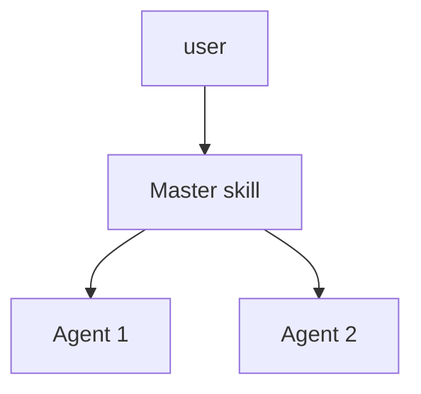

# <team-slug>

> One-line mission statement.

## Overview

Describe what this team does, what problem it solves, and the agents/skills it ships.

## Skills

| Skill | Purpose |
| ----- | ------- |

## Subagents

| Agent | Role | Tools |
| ----- | ---- | ----- |

## Architecture



## Standards & references

- Standard 1
- Standard 2

## Install

```bash
bash scripts/install.sh --teams <team-slug>
```

## Contributing

See [`docs/contributing/adding-a-team.md`](../contributing/adding-a-team.md).
